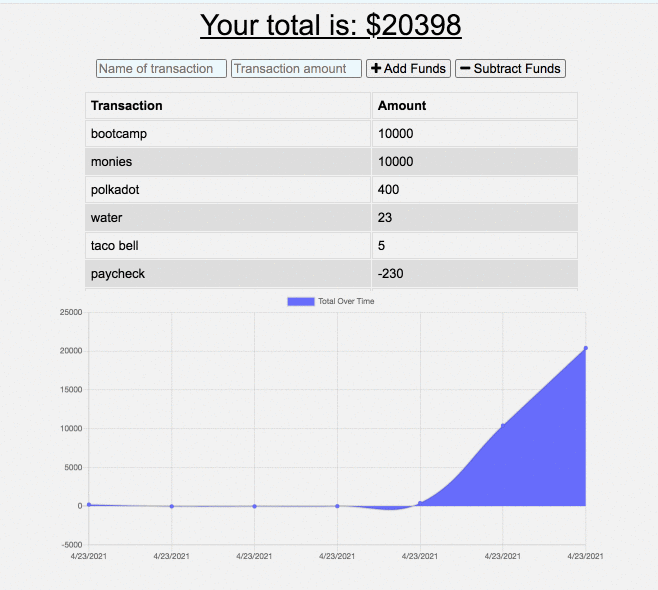

# pennysaver

## Description
Penny$aver is a progressive web application (PWA) that allows you to track your spending and deposits. IndexedDB and the cache API allow you to continue tracking transactions even while offline. Its mobile and desktop friendly.

## Table of Contents
* [User Story](#user-story)
* [Installation](#installation)
* [Technology Used](#technology-used)
* [Usage](#usage)
* [Author info](#author-info)

## User Story
USER STORY AS AN avid traveler I WANT to be able to track my withdrawals and deposits with or without a data/internet connection SO THAT my account balance is accurate when I am traveling 

## Installation

## Technology Used
* Javascript
* Express
* MongoDB Atlas
* MongoDB
* Heroku

## Usage

## Author Info
[Github: es2013](https://github.com/es2013)
[Deployed Link](https://github.com/es2013/pennysaver)